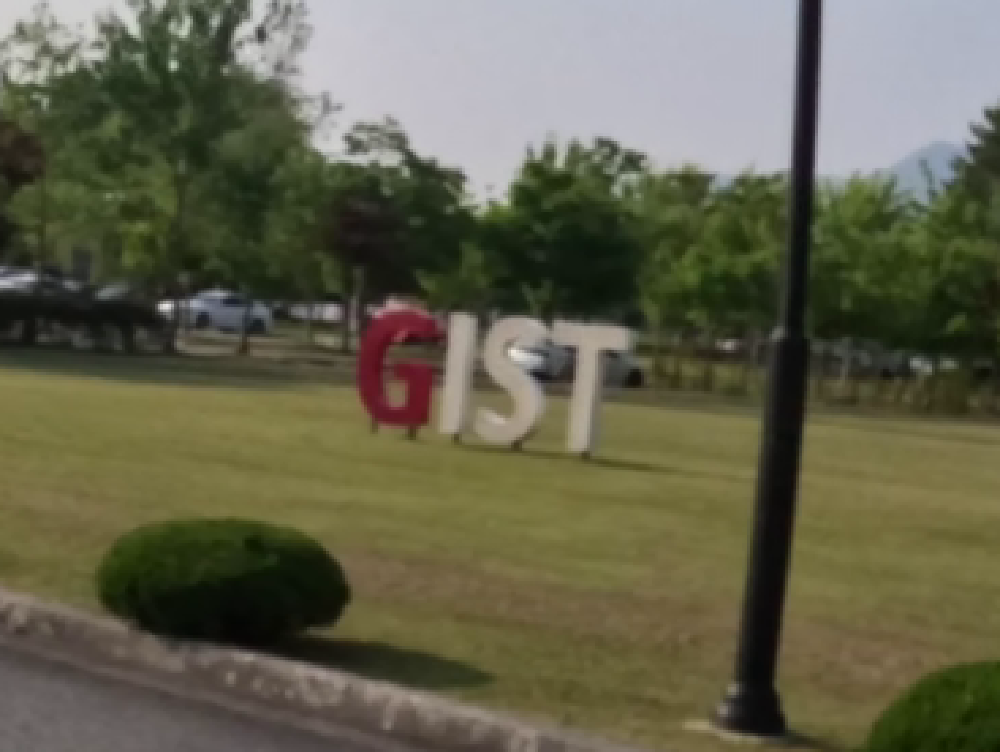
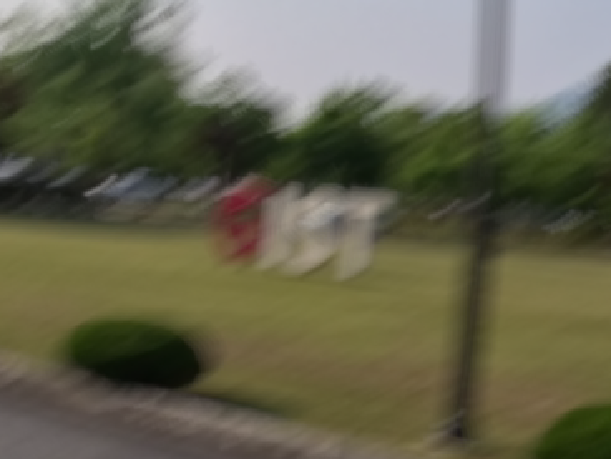
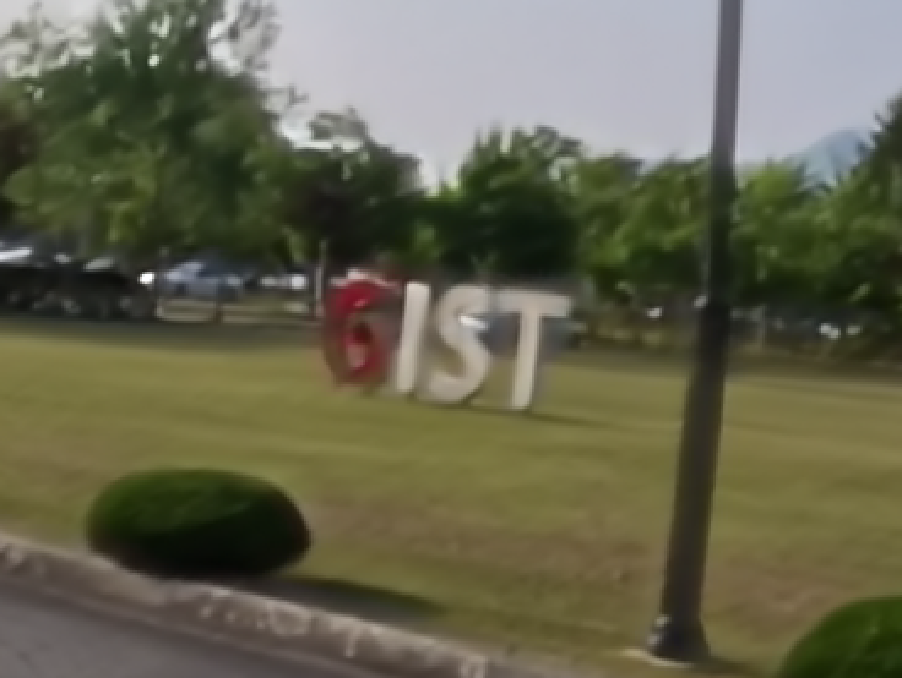
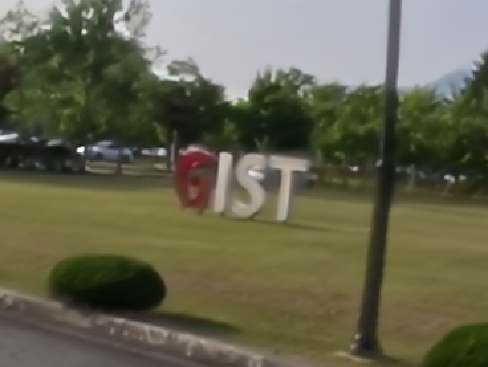
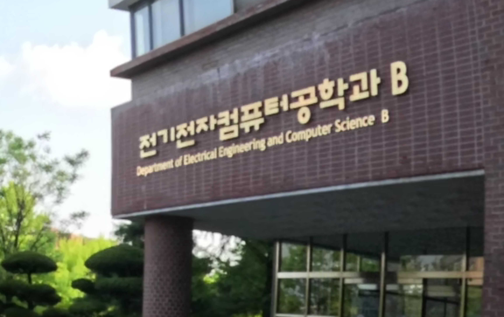
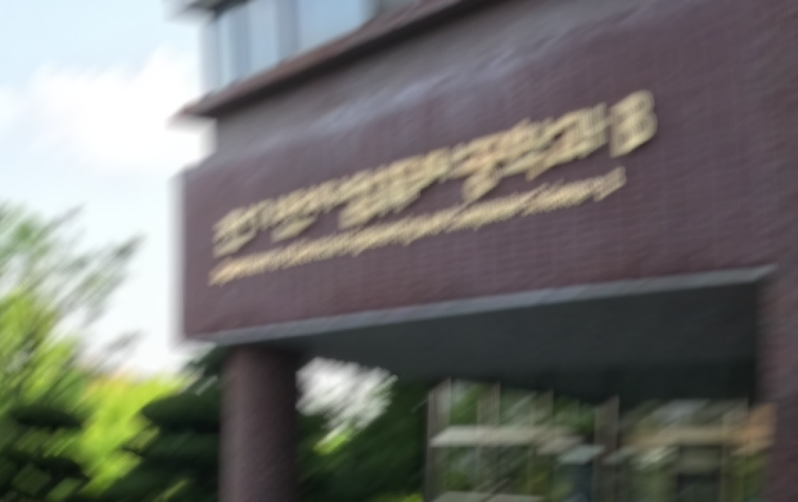
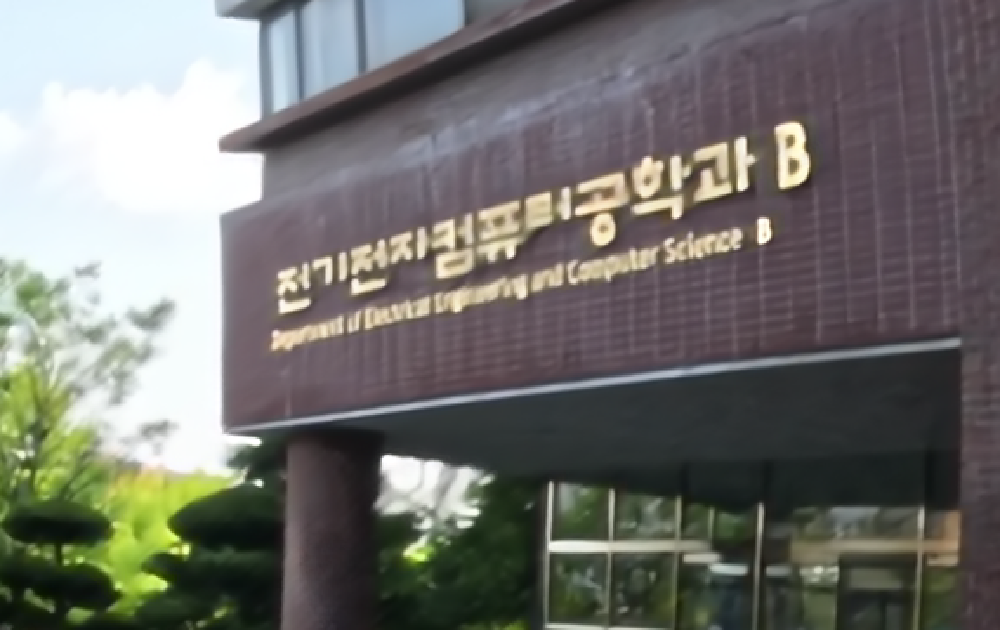

# IMUDeblurNet

IMUDeblurNet is a two-stage deblurring pipeline. Stage1 predicts a gyro window
from a blurred image. The gyro window is converted into a camera motion field
(CMF), and Stage2 restores the sharp image from the blurred image and CMF.

| Sharp Image | Blur Image | [NAFNet](https://github.com/megvii-research/nafnet) | [Restormer](https://github.com/swz30/Restormer) | IMUDeblur (ours) |
| :---: | :---: | :---: | :---: | :---: |
|  |  |  |  |  |
|  |  |  |  |  |

## Table of Contents

- [Pipeline](#pipeline)
- [Environment](#environment)
- [Repository Layout](#repository-layout)
- [Camera Calibration](#camera-calibration)
- [Data and Weights](#data-and-weights)
- [Quick Start: Reproducibility Check](#quick-start-reproducibility-check)
- [Code Example](#code-example)
- [AI Tool Usage](#ai-tool-usage)
- [References](#references)

## Pipeline

```text
Blurred image
    |
    v
Stage1: blur -> gyro window
    |
    v
Differentiable / offline CMF generation
    |
    v
Stage2: blur + CMF -> deblurred image
```

The Stage1 target is a gyro window with shape `7 x 3`. The seven vectors are
adjacent timestamped angular velocity samples. CMF generation converts the
seven gyro samples into six interval rotations:

```text
theta_i = 0.5 * (gyro_i + gyro_{i+1}) * dt_i,  i = 0 ... 5
```
Thus:

```text
gyro window: 7 x 3 = 21 scalar values
theta:       6 x 3 = 18 scalar values
CMF:         6 x 2 = 12 motion channels
```

Each `theta_i` is converted to a rotation matrix, then to an image homography
`H = K R K^-1`. Projecting image grid points through `H` gives per-pixel
displacements `(dx, dy)`. Six displacement pairs become a 12-channel CMF.


## Environment
Recommended environment:

- Python 3.10
- CUDA-capable GPU recommended
- PyTorch with CUDA 11.8

```bash
conda create -n IMUDeblurNet python=3.10
conda activate IMUDeblurNet
pip install -r requirements.txt
```

Main dependencies are pinned in `requirements.txt`.

```text
--extra-index-url https://download.pytorch.org/whl/cu118
torch==2.6.0+cu118
torchvision==0.21.0+cu118
numpy==1.26.4
opencv-python==4.9.0.80
PyYAML==6.0.2
tqdm==4.67.1
pyiqa==0.1.15.post2
lpips==0.1.4
matplotlib==3.10.9
```

If CUDA 11.8 is not available, install a PyTorch build matching the target
machine first, then install the remaining packages from `requirements.txt`.

## Repository Layout

```text
.
+-- assets/                         # Images used in README
+-- camera_calibration/             # Camera calibration helpers
+-- config/                         # Training and evaluation configs
+-- data/                           # Dataset root for large files
+-- datasets/                       # Dataset loaders
+-- models/                         # Stage1, Stage2, and CMF modules
+-- result/                         # Training outputs
+-- runs/                           # Evaluation and inference outputs
+-- scripts/                        # Dataset-specific bash quick starts
+-- utils/                          # Losses, metrics, logging, checkpoints
+-- weights/                        # Pretrained checkpoints
+-- generate_camera_motion_field.py # Offline CMF generation
+-- train_stage1.py
+-- train_stage2.py
+-- train_stage1_stage2_finetune.py
+-- validate_stage1.py
+-- validate_stage2.py
+-- validate_stage1_stage2.py
+-- inference_stage1.py
+-- inference_stage2.py
+-- inference_stage1_stage2.py
+-- inference_stage1_stage2_finetune.py
`-- validate_stage1_stage2_finetune.py
```

## Camera Calibration

Camera intrinsics are used when gyro windows are converted into CMF. The camera
matrix is

```text
K = [[fx, 0,  cx],
     [0,  fy, cy],
     [0,  0,  1 ]]
```

Stage1-only validation does not need `K`. Stage2-only validation uses
precomputed CMF, so `K` must be set when generating CMF. Stage1 + Stage2 and
fine-tuned Stage1 + Stage2 generate CMF during evaluation, so `K` can be passed
directly to the validation script.

Run checkerboard calibration:

```bash
python camera_calibration/calibration.py \
  --input-dir <path_to_checkerboard_images> \
  --output-dir result/calibration \
  --board-size 8x6 \
  --square-size <checkerboard_square_size>
```

The calibration report is saved under `result/calibration/`. Use the reported
camera matrix values as `fx`, `fy`, `cx`, and `cy`.

Generate CMF with a custom `K`:

```bash
python generate_camera_motion_field.py \
  --data_root data/IMUBlur \
  --mode test \
  --camera-fx <fx> \
  --camera-fy <fy> \
  --camera-cx <cx> \
  --camera-cy <cy> \
  --overwrite
```

Validate Stage1 + Stage2 with a custom `K`:

```bash
python validate_stage1_stage2.py \
  --stage1-checkpoint weights/best_stage1.pt \
  --stage2-checkpoint weights/best_stage2.pt \
  --dataset-root <dataset_root> \
  --split test \
  --camera-fx <fx> \
  --camera-fy <fy> \
  --camera-cx <cx> \
  --camera-cy <cy>
```

Validate the fine-tuned Stage1 + Stage2 model with a custom `K`:

```bash
python validate_stage1_stage2_finetune.py \
  --checkpoint weights/best_finetuned.pt \
  --dataset-root <dataset_root> \
  --split test \
  --camera-fx <fx> \
  --camera-fy <fy> \
  --camera-cx <cx> \
  --camera-cy <cy>
```

## Data and Weights

Place datasets and checkpoints as follows.

```text
data/
`-- IMUBlur/
    +-- train/
    +-- val/
    `-- test/

weights/
+-- segnext_iaai.pth
+-- best_stage1.pt
+-- best_stage2.pt
`-- best_finetuned.pt
```

The dataset and checkpoint files can be downloaded from Google Drive.

- **IMUBlur dataset**: [Google Drive](https://drive.google.com/drive/folders/1Ttp6ytm7rvdYyj3hU1uZvi82c9a2f-hZ)
- **Pretrained weights**: [Google Drive](https://drive.google.com/drive/folders/14-4GSpS8fip-zLHqwzkYziXM22RQbeRi)

IMUBlur was captured with a GoPro HERO 13 action camera at 1080p
resolution (`1920 x 1080`).

For Stage1 training, download the SegNeXt backbone checkpoint from the
Getting Started section of [jerredchen/image-as-an-imu](https://github.com/jerredchen/image-as-an-imu)
and place it at `weights/segnext_iaai.pth`.

## Quick Start: Reproducibility Check

The commands below run validation checks and save `metrics.json`,
`samples.csv`, and visual outputs under `runs/`.

The reproducibility check uses the default camera calibration values in the
codebase, so explicit camera calibration arguments are omitted here.

The quick start scripts under `scripts/` are bash scripts. Run them from Linux,
WSL, or Git Bash on Windows. The equivalent `python ...` commands can be run
directly from a terminal.

### Reproducibility Scope

Full training is reproducible when the complete dataset, CMF files, pretrained
weights, and sufficient GPU resources are available. If full training is not
practical, the submitted checkpoints reproduce the reported validation and test
results through the commands below.

### 1. Stage1

```bash
python validate_stage1.py \
  --checkpoint weights/best_stage1.pt \
  --dataset-root data/IMUBlur \
  --split test
```
**Quick start bash script:**

```bash
bash scripts/IMUBlur/01_imublur_validate_stage1.sh
```
This code validates Stage1 gyro prediction on IMUBlur.

### 2. Stage2

Stage2 uses precomputed CMF files. If the downloaded dataset does not already
include `camera_motion_field/`, generate CMF before running Stage2 validation.

```bash
python generate_camera_motion_field.py \
  --data_root data/IMUBlur \
  --mode test \
  --overwrite
```
This code generates 12-channel CMF files for the IMUBlur test split.

```bash
python validate_stage2.py \
  --checkpoint weights/best_stage2.pt \
  --dataset-root data/IMUBlur \
  --split test
```
**Quick start bash script:**

```bash
bash scripts/IMUBlur/02_imublur_validate_stage2.sh
```
This code validates Stage2 deblurring on IMUBlur with precomputed CMF.

### 3. Stage1 + Stage2

```bash
python validate_stage1_stage2.py \
  --stage1-checkpoint weights/best_stage1.pt \
  --stage2-checkpoint weights/best_stage2.pt \
  --dataset-root data/IMUBlur \
  --split test \
  --load-target-gyro
```
**Quick start bash script:**

```bash
bash scripts/IMUBlur/03_imublur_validate_stage1_stage2.sh
```
This code validates the non-fine-tuned Stage1 + Stage2 pipeline on IMUBlur.

### 4. Stage1 + Stage2 Fine-Tune

```bash
python validate_stage1_stage2_finetune.py \
  --checkpoint weights/best_finetuned.pt \
  --dataset-root data/IMUBlur \
  --split test \
  --load-target-gyro
```
**Quick start bash script:**

```bash
bash scripts/IMUBlur/04_imublur_validate_stage1_stage2_finetune.sh
```
This code validates the final fine-tuned model on IMUBlur.

## Code Example
### Training Code

#### Generate CMF

Stage1 training does not need CMF,
but Stage2 training reads precomputed CMF files from the dataset directory.

```bash
python generate_camera_motion_field.py --data_root data/IMUBlur --mode all --overwrite
```
This code generates 12-channel CMF files from gyro windows.

#### Train Stage1

```bash
python train_stage1.py --config config/stage1.yaml
```
This code trains Stage1 blur-to-gyro prediction.

#### Train Stage2

```bash
python train_stage2.py --config config/stage2_deblur.yaml
```
This code trains Stage2 deblurring with precomputed CMF.

#### Fine-Tune Stage1 + Stage2

```bash
python train_stage1_stage2_finetune.py \
  --config config/stage1_stage2_finetune.yaml
```
This code fine-tunes the Stage1 + differentiable CMF + Stage2 pipeline.

Training outputs are saved under `result/`.

### Validation Code

Use the final fine-tuned checkpoint for the main validation numbers.

```bash
python validate_stage1_stage2_finetune.py \
  --checkpoint weights/best_finetuned.pt \
  --dataset-root data/IMUBlur \
  --split val \
  --load-target-gyro
```
This code validates the final fine-tuned model on the IMUBlur validation split.

Validation outputs are saved under `runs/`.

### Inference Code Example

#### Stage1 Single Image File

```bash
python inference_stage1.py \
  --checkpoint weights/best_stage1.pt \
  --input <path_to_blur_image.png>
```
This code predicts a gyro window from one blurred image file.

#### Stage1 Image Folder

```bash
python inference_stage1.py \
  --checkpoint weights/best_stage1.pt \
  --input <path_to_blur_image_folder>
```
This code predicts gyro windows for all images directly inside the input folder.

#### Generate CMF for Stage2

Stage2-only inference needs a precomputed CMF. For dataset images, generate CMF
first if it is not already included. For an arbitrary single image, provide a
matching CMF file through `--motion-input`.

```bash
python generate_camera_motion_field.py \
  --data_root data/IMUBlur \
  --mode test \
  --overwrite
```
This code prepares CMF files for Stage2-only inference on IMUBlur test images.

#### Stage2 Single Image File

```bash
python inference_stage2.py \
  --checkpoint weights/best_stage2.pt \
  --input <path_to_blur_image.png> \
  --motion-input <path_to_cmf.npy>
```
This code restores one blurred image using a precomputed CMF file.

#### Stage2 Image Folder

```bash
python inference_stage2.py \
  --checkpoint weights/best_stage2.pt \
  --input <path_to_blur_image_folder> \
  --motion-input <path_to_cmf_folder>
```
This code restores all images directly inside the input folder using matching CMF files.

#### Stage1 + Stage2 Single Image File

```bash
python inference_stage1_stage2.py \
  --stage1-checkpoint weights/best_stage1.pt \
  --stage2-checkpoint weights/best_stage2.pt \
  --input <path_to_blur_image.png>
```
This code predicts gyro, generates CMF, and restores one blurred image.

#### Stage1 + Stage2 Image Folder

```bash
python inference_stage1_stage2.py \
  --stage1-checkpoint weights/best_stage1.pt \
  --stage2-checkpoint weights/best_stage2.pt \
  --input <path_to_blur_image_folder>
```
This code predicts gyro, generates CMF, and restores all images directly inside the input folder.

#### Stage1 + Stage2 Fine-Tuned Single Image File

```bash
python inference_stage1_stage2_finetune.py \
  --checkpoint weights/best_finetuned.pt \
  --input <path_to_blur_image.png> \
  --save-visuals
```
This code runs the final fine-tuned pipeline on one blurred image file.

#### Stage1 + Stage2 Fine-Tuned Image Folder

```bash
python inference_stage1_stage2_finetune.py \
  --checkpoint weights/best_finetuned.pt \
  --input <path_to_blur_image_folder> \
  --save-visuals
```
This code runs the final fine-tuned pipeline on all images directly inside the input folder.

Inference outputs are written under `runs/<run_name>/`. Stage1-only inference
saves gyro predictions to `predictions.csv` and visualizations to `visuals/`.
Stage2 and Stage1 + Stage2 inference also save restored images to `outputs/`.

## AI Tool Usage

OpenAI ChatGPT/Codex was used for repository inspection, debugging support,
gyro-to-CMF explanation, and README drafting. Reported metrics are produced by
the evaluation scripts in this repository.

## References

- **Image as an IMU: Estimating Camera Motion from a Single Motion-Blurred Image**:
  [Paper](https://arxiv.org/abs/2503.17358) / [GitHub](https://github.com/jerredchen/image-as-an-imu)
- **Gyro-based Neural Single Image Deblurring**:
  [Paper](https://arxiv.org/abs/2404.00916) / [GitHub](https://github.com/hmyang0727/GyroDeblurNet)
- **NAFNet: Simple Baselines for Image Restoration**:
  [Paper](https://arxiv.org/abs/2204.04676) / [GitHub](https://github.com/megvii-research/NAFNet)
- **Restormer: Efficient Transformer for High-Resolution Image Restoration**:
  [Paper](https://arxiv.org/abs/2111.09881) / [GitHub](https://github.com/swz30/Restormer)
